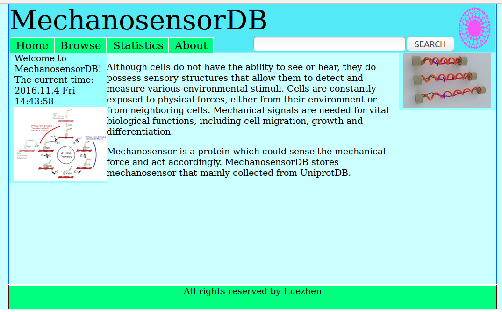
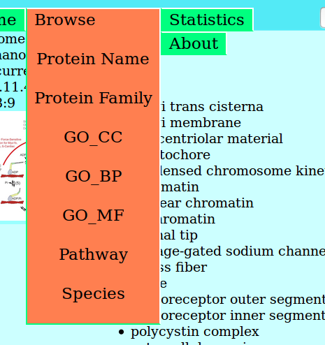
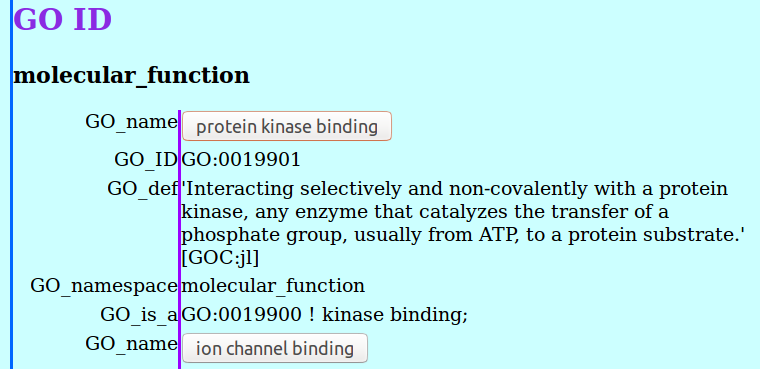
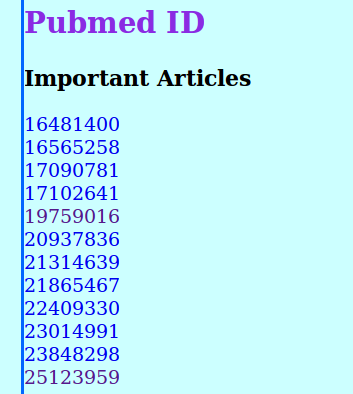
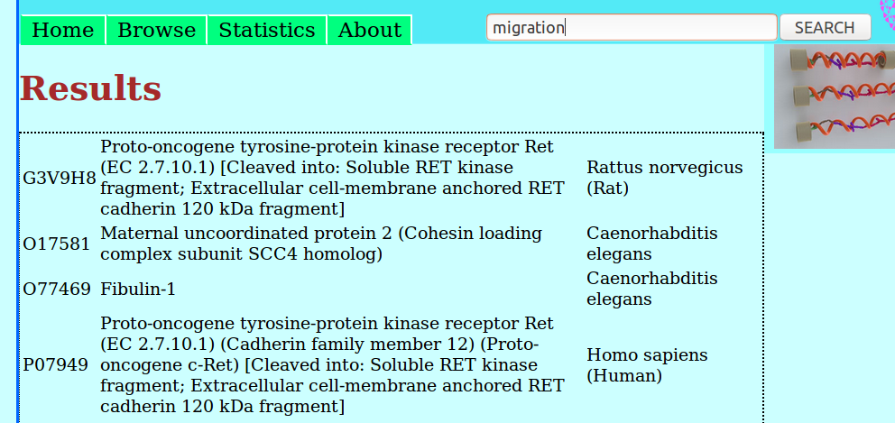

# MechanosensorDB
Although cells do not have the ability to see or hear, they do possess sensory structures that allow them to detect and measure various environmental stimuli. Cells are constantly exposed to physical forces, either from their environment or from neighboring cells. Mechanical signals are needed for vital biological functions, including cell migration, growth and differentiation.

Mechanosensor is a protein which could sense the mechanical force and act accordingly. MechanosensorDB stores mechanosensor that mainly collected from UniprotDB.

## The use of MechanosensorDB
MechanosensorDB is willing to integrate all knowledge of mechanosensors, and hope to broaden your knowledge in mechanobiology.

1. Browse all mechanosensor grouped by 'Protein name', 'GO cellular component', 'GO molecular function', 'GO biological pathway', and 'organism'.
2. Search gene name, protein name, and functions through top right search bar.
3. Protein information page contains not only functions, GO terms, etc., but also several selected articles which studies the mechanosensing aspect of the protein.

## The design of MechanosensorDB
MechanosensorDB uses HTML, CSS, Javascript, Php, and mysql to support your research in mechanobiology.

1. The main page is 'index.html'.
2. All web page organization, event catch, sending and receiving data from server are done in Javascript.
3. Search mysql database use Php.
4. With AJAX, MechanosensorDB can update a web page, call php in server, and so on without reloading the page.

## Statistics

Counts | Item
-------|-------
37521  |Number of Proteins
36758  |Number of Proteins Name with 'mechano'
763    |Number of Proteins Name without 'mechano'
7990   |Number of Proteins with Family Info
29531  |Number of Proteins No Family Info (in uniprot)
10846  |Number of Organisms
146    |Number of Proteins with Tissue Specificity Info
19     |Number of Proteins with Expression Inducer Info
35143  |Number of Proteins with GO
258 / 4164(all)|Number of GO CC
259 / 11185(all)|Number of GO MF
930 / 29741(all)|Number of GO BP
10800  |Number of Articles
829    |Number of Articles with 'mechano' or 'force'
2763   |Number of Articles with 'mechano'(Pubmed)

### Enriched GO Terms

Counts | Item
-------|-------
33851  |integral component of membrane(CC)
22375  |transmembrane transport(BP)
8441   |ion channel activity(MF)
7053   |plasma membrane(CC)
2932   |mechanically-gated ion channel activity(MF)
2320   |cellular response to osmotic stress(BP)
711    |membrane(CC)
253    |calcium ion binding(MF)
187    |ATP binding(MF)
150    |mechanosensory behavior(BP)
126    |integral component of plasma membrane(CC)
124    |cytoplasm(CC)
119    |nucleus(CC)(CC)
118    |mechanoreceptor differentiation(BP)
96     |positive regulation of synapse assembly(BP)
95     |receptor complex(CC)
94     |circadian rhythm(BP)
67     |positive regulation of neuron projection development(BP)
67     |positive regulation of gene expression(BP)
67     |cell volume homeostasis(BP)

## Snapshots of MechanosensorDB

### Home Page

### Browse Page

### GO ID Shown in Protein Information Page

### Selected Publication in Protein Information Page
These articles study the mechanosensing aspect of the mechanosensor.

### Search Results

